# TCP - Tahoe, Reno, NewReno, SACK

## TCP Tahoe

Tahoe variant of TCP consider duplicate ACKs are packet lost event. Once sender receive 3 duplicate ACKs which means 4 ACKs for one packet, Tahoe start fast retransmit (it does not wait to retransmission timer to expire), sets slow start threshold to half of the current congestion window size, reduce the congestion window to 1 and reset to slow start.

Once it rech the slow start threshold, with every ACK received it increase the congestion window size by one.

## TCP Reno

Reno variant of TCP use Fast Recovery, Fact Recovery assume that each ACK received represents a single packet sent, using this assumption sender can estimate the amount of outstanding data.

Like Tahoe, Reno also use duplicate ACKs threshold, if sender receive 3 dupliate ACKs, it perform the fast retransmit and unlike Tahoe skip the slow start.

## TCP New Reno

TCP New Reno is similar to Reno in case on single packet drop, difference is when multiple packets are dropped from a window. During fast recovery, if partial ack is received for few of the packets, Reno takes out TCP from Fast Recovery mode. However, new reno does not out TCP out from Fast Recovery and treat it as indicator that the packet having sequence after ack is lost. Therefore, new reno retransmit one lost packet per rount trip until all lost packet in that window is delivered. 

New Reno is moved out of Fast Recovery, if it receive ack for all the outstanding packets.

## TCP SACK

During Fast Recovery, SACK maintain a variable called pipe. Pipe estimates the outstanding number of packets in the path. If the number of packets in the path is less than congestion window size then only sender transmit new or retransmit data. Pipe is incremented by one if sender sent one or retramit a packet. It decrement by one if sender receive duplicate acks.

## Simulation


For simulation, I have used ns2 script.

### Network Topology

```
 Create the following topology:             
          node 0
            \ 
    8Mb,.1ms \ 
	          \ 
      8Mb,.1ms \       0.8Mb,100ms
 node 1 ------node 3 --------- node 4
               /
              /
    8Mb,.1ms /
            /
          node 2
```

As shown in above figure, network has 5 nodes
 ```node0, node1, node2, node3 and node4```
 
#### Capacity and delay
- node0 to node3 has 8Mb capacity and 0.1ms of delay
- node1 to node3 has 8Mb capacity and 0.1ms of delay
- node2 to node3 has 8Mb capacity and 0.1ms of delay
- node3 to node4 has 0.8Mb capacity and 100ms of delay

#### DropTail:
Drop tail is used for queue buffer. Drop tail is the simple queueing mechanis used by the router to determine when to drop packet. In this scenario, each packet is treated as identical and when queue is full to its maximum capacity new packet is dropped, until when queue has enough space for new packet

#### ns-script
In the script, three methods are implemented to simulate 1 packet drop, 2 packet drop and 3 packet drop scenarios.

Each source is made as FTP source and max packet is defined for the source to simulate packet drop scenarios. 

Source-1 starts packet transfer at 1s timestamp and source-2 starts packet transfer at 1.2s timestamp and source-3 starts packet transfer at 1.18s timestamp. 

Script will finish the simulation after 6 secs.

Script is identical for all the TCP variant only different is TCP implementation for source node and destination node as follows.

#### Tahoe
Tahoe is the classic TCP variant, here ```Agent/TCP``` is used for source and ```Agent/TCPSink``` is used for the destination nodes.

#### Reno
For Reno TCP, source is defined as ```Agent/TCP/Reno``` and destination node is same as Tahoe ```Agent/TCPSink```

#### New Reno
For new reno TCP, source is defined as ```Agent/TCP/Newreno``` and destination node is same as Tahoe ```Agent/TCPSink```

#### SACK
For SACK TCP, source is defined as ```Agent/TCP/Sack1``` and destination node is defined as  ```Agent/TCPSink/Sack1```


### Execution

After the script is setup, I have saved 4 scripts based on the source and destination variant of TCP as mentioned above.

- tcp_drop_tahoe.tcl
- tcp_drop_reno.tcl
- tcp_drop_newreno.tcl
- tcp_drop_sack.tcl

>To simulate Tahoe 1-packet drop execute the command ```ns tcp_drop_tahoe.tcl 1```

>To simulate Tahoe 2-packet drop execute the command ```ns tcp_drop_tahoe.tcl 2```

>To simulate Tahoe 3-packet drop execute the command ```ns tcp_drop_tahoe.tcl 3```

>To simulate Reno 1-packet drop execute the command ```ns tcp_drop_reno.tcl 1```

>To simulate Reno 2-packet drop execute the command ```ns tcp_drop_reno.tcl 2```

>To simulate Reno 3-packet drop execute the command ```ns tcp_drop_reno.tcl 3```

>To simulate NewReno 1-packet drop execute the command ```ns tcp_drop_newreno.tcl 1```

>To simulate NewReno 2-packet drop execute the command ```ns tcp_drop_newreno.tcl 2```

>To simulate NewReno 3-packet drop execute the command ```ns tcp_drop_newreno.tcl 3```

>To simulate SACK 1-packet drop execute the command ```ns tcp_drop_sack.tcl 1```

>To simulate SACK 2-packet drop execute the command ```ns tcp_drop_sack.tcl 2```

>To simulate SACK 3-packet drop execute the command ```ns tcp_drop_sack.tcl 3```


After execution of the script, it generates ```out.tr``` file. This is the trace file contains logs about the packet transmission.

Each line in out.trace contains following information

- state of the packet
    - ```r``` : receive; packet is received at the destination node
    - ```+``` : enqueue; packet is enqueue in the queue buffer
    - ```-``` : dequeue; packet is dequeue from the queue buffer
    - ```d``` : drop; packet is dropped
- timestamp
- source node
- destination node
- type : if the packet is ***tcp*** or ***ack*** packet
- size : packet size
- flag information
- ip address of source node
- ip address of destination node
- packet sequence number
- packet id

## Analysis

Below the script to extract information from the ```out.tr``` file and analyse the simulation


```python
# import necessary libraries
import sys
import matplotlib.pyplot as plt
%matplotlib inline 
```


```python
# define consts

RECEIVE = 'r'
ENQUEUE = '+'
DEQUEUE = '-'
DROP = 'd'
```


```python
# extract the information for the trace line
def process_trace(trace_line):
    tr_map = {}
    tr = trace_line.split(' ')

    tr_map['state'] = tr[0]
    tr_map['ts'] = tr[1]
    tr_map['from'] = tr[2]
    tr_map['to'] = tr[3]
    tr_map['type'] = tr[4]
    tr_map['size'] = tr[5]
    tr_map['from_ip'] = tr[8]
    tr_map['to_ip'] = tr[9]
    tr_map['seq_num'] = tr[10]
    tr_map['pkt_id'] = tr[11]

    return tr_map
```


```python
# extract out information from all the log present in out.tr
def get_traces(filename):
    # open trace file
    trace_file = open(filename, "r")
    traces = []
    for trace in trace_file:
        tr = process_trace(trace.rstrip())
        traces.append(tr)
    return traces
```

### Analysis

***Total time simulation run :***  Total time the simulation is executed.

***Total number of packets recevied by destination node (node-4) :***  Total number of packets received by destination node.

***Packets per sec from node-3 to node-4 :***  Total number of packets received by destination per second ie total number of packet recieved by destination divided by total time run.

***Total Data passed from node-3 to node-4 :***  Per packet size id 1040, therefore, total data passed is the number of packets multipled by 1040.

***Data per sec :***  like packets per sec, this is total data passed divided by the total time run.

***Packets from source (node-0) to destination (node-4) :***  Total packets through from source to destination.

***Packets/sec from source (node-0) to destination (node-4) :***  Packets through from source to destination per second (divided by total time run).

***Data from source (node-0) to destination (node-4) :***  Data passed through source to destination

***Data per sec from source (node-0) to destination (node-4) :***  Data transmitted from source to destination per second.

***Average delay from source (node-0) to destination (node-1) :***  It the difference between the time packet is enqueue in source node and received at the destination node.

***Average Round Trip Time for a packet froms source (node-0) to destination (node-1) :***  It is the round trip time, time difference between the packet is enqueued in source and ack is received back to source node.


```python
def total_through(trace_map):
    rec = {}
    enq = {}
    ack = {}
    
    for tr in trace_map:
        if (tr['state'] == RECEIVE and 
            tr['from'] == '3' and
            tr['to'] == '4' and
            tr['type'] == 'tcp'):
            rec[tr['seq_num']] = float(tr['ts'])
        
        if (tr['state']==ENQUEUE and
            tr['from'] == '0' and
            tr['to'] == '3' and
            tr['type'] == 'tcp'):
            enq[tr['seq_num']]  = float(tr['ts'])

        if (tr['state']==RECEIVE and
            tr['from'] == '3' and
            tr['to'] == '0' and
            tr['type'] == 'ack'):
            ack[tr['seq_num']] = float(tr['ts'])
            
            
    start_time = min(list(enq.values()))
    end_time = max(list(enq.values()) )
    
    total_time = end_time - start_time
    print('Total time simulation run : ', total_time)
            
    total_pkts = len(rec)
    print('Total number of packets recevied by destination node (node-4) : ', total_pkts)
    print('Packets per sec from node-3 to node-4 : ', total_pkts/total_time)
    
    total_data = total_pkts * 1040 #size of one pkt
    print('Total Data passed from node-3 to node-4 : ', total_data)
    print('Data per sec : ', total_data/total_time)
    
    #totak pkts from node-0 to node-4
    total_pkts_node_0 = 0
    for pkt in enq:
        if pkt in rec:
            total_pkts_node_0 += 1
            
    print('Packets from source (node-0) to destination (node-4) : ', total_pkts_node_0)    
    print('Packets/sec from source (node-0) to destination (node-4) : ', total_pkts_node_0/total_time)
        
    
    total_data_node_0 = total_pkts_node_0 * 1040
    print('Data from source (node-0) to destination (node-4) : ', total_data_node_0)
    print('Data/sec from source (node-0) to destination (node-4) : ', total_data_node_0/total_time)
    
    #avg delay from node-0 to node-4
    delay = 0
    delay_count = 0
    for pkt in enq:
        if pkt in rec:
            delay = delay + (rec[pkt] - enq[pkt])
            delay_count = delay_count + 1
    avg_delay = delay/delay_count
    print('Average delay from source (node-0) to destination (node-1) : ', avg_delay)
    
    #avg RTT for a packet from node-0 to node-4 and ack back to node-0
    rtt = 0
    rtt_count = 0
    for pkt in enq:
        if pkt in ack:
            rtt = rtt + (ack[pkt] - enq[pkt])
            rtt_count = rtt_count + 1
    avg_rtt = rtt/rtt_count
    print('Average Round Trip Time for a packet froms source (node-0) to destination (node-1) : ', avg_rtt)
    
    return (total_pkts, total_pkts_node_0, avg_delay, avg_rtt)
```

### Plot

Plot the summary of packet delay and packet drop


```python
def plot(traces):
    plt.figure(figsize=(20,10))
    enq = {}
    ack = {}
    drop = {}

    for tr in traces:
        if (tr['state']==ENQUEUE and
            tr['from'] == '0' and
            tr['to'] == '3' and
            tr['type'] == 'tcp'):
            enq[tr['seq_num']]  = tr['ts']

        if (tr['state']==RECEIVE and
            tr['from'] == '3' and
            tr['to'] == '0' and
            tr['type'] == 'ack'):
            ack[tr['seq_num']] = tr['ts']
            
        if (tr['state']==DROP and
            tr['from'] == '3' and
            tr['to'] == '4' and
            tr['type'] == 'tcp'):
            drop[tr['seq_num']] = tr['ts']
    
    e_seq, e_ts = zip(*sorted(enq.items()))
    e_seq = [float(item)%50 for item in e_seq]
    e_ts = [float(item) for item in e_ts]
    
    a_seq, a_ts = zip(*sorted(ack.items()))
    a_seq = [float(item)%50 for item in a_seq]
    a_ts = [float(item) for item in a_ts]
    
    d_seq, d_ts = zip(*sorted(drop.items()))
    d_seq = [float(item)%50 for item in d_seq]
    d_ts = [float(item) for item in d_ts]

    plt.plot(e_ts, e_seq, 's', color='green', label='receive')
    plt.plot(a_ts, a_seq, '.', color='blue', label='ack')
    plt.plot(d_ts, d_seq, 'x', color='red', label='drop')
    
    plt.legend(loc='upper left')
    
    plt.show()
```


```python
total_pkts = {'t': [0, 0, 0],
              'r' : [0, 0, 0],
              'n' : [0, 0, 0],
              's' : [0, 0, 0]}

pkts_src_dest = {'t': [0, 0, 0],
              'r' : [0, 0, 0],
              'n' : [0, 0, 0],
              's' : [0, 0, 0]}

avg_delay = {'t': [0, 0, 0],
              'r' : [0, 0, 0],
              'n' : [0, 0, 0],
              's' : [0, 0, 0]}

avg_rtt = {'t': [0, 0, 0],
              'r' : [0, 0, 0],
              'n' : [0, 0, 0],
              's' : [0, 0, 0]}
```


```python
# read the tahoe one packet drop trace
tahoe_drop_1 = './tahoe/pkt_drop_1/out.tr'
traces_tahoe_drop_1 = get_traces(tahoe_drop_1)
```


```python
total_pkts['t'][0], pkts_src_dest['t'][0], avg_delay['t'][0], avg_rtt['t'][0] = total_through(traces_tahoe_drop_1)
```

    Total time simulation run :  4.98996
    Total number of packets recevied by destination node (node-4) :  229
    Packets per sec from node-3 to node-4 :  45.8921514400917
    Total Data passed from node-3 to node-4 :  238160
    Data per sec :  47727.83749769537
    Packets from source (node-0) to destination (node-4) :  229
    Packets/sec from source (node-0) to destination (node-4) :  45.8921514400917
    Data from source (node-0) to destination (node-4) :  238160
    Data/sec from source (node-0) to destination (node-4) :  47727.83749769537
    Average delay from source (node-0) to destination (node-1) :  0.1305211353711791
    Average Round Trip Time for a packet froms source (node-0) to destination (node-1) :  0.22135704433497547


```python
plot(traces_tahoe_drop_1)
```


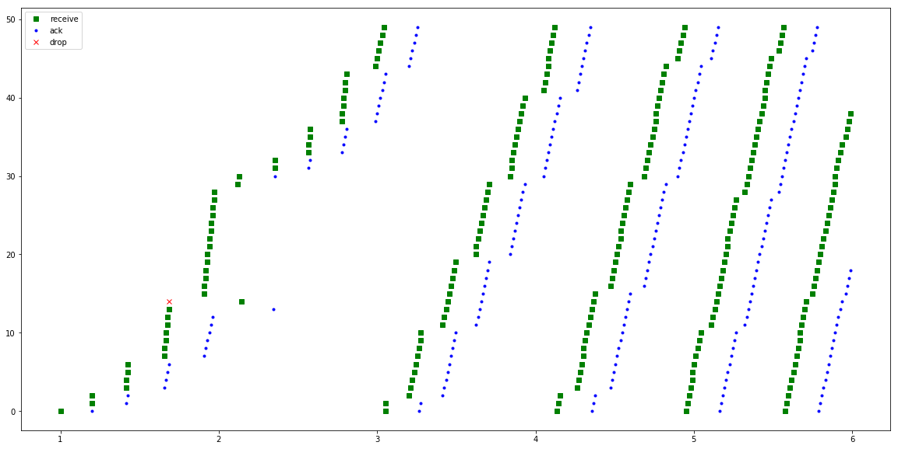


## Tahoe two packets drop


```python
# read the tahoe one packet drop trace
tahoe_drop_2 = './tahoe/pkt_drop_2/out.tr'
traces_tahoe_drop_2 = get_traces(tahoe_drop_2)
```


```python
total_pkts['t'][1], pkts_src_dest['t'][1], avg_delay['t'][1], avg_rtt['t'][1] = total_through(traces_tahoe_drop_2)
```

    Total time simulation run :  4.98996
    Total number of packets recevied by destination node (node-4) :  224
    Packets per sec from node-3 to node-4 :  44.89013939991503
    Total Data passed from node-3 to node-4 :  232960
    Data per sec :  46685.74497591163
    Packets from source (node-0) to destination (node-4) :  224
    Packets/sec from source (node-0) to destination (node-4) :  44.89013939991503
    Data from source (node-0) to destination (node-4) :  232960
    Data/sec from source (node-0) to destination (node-4) :  46685.74497591163
    Average delay from source (node-0) to destination (node-1) :  0.13057339285714278
    Average Round Trip Time for a packet froms source (node-0) to destination (node-1) :  0.2225252261306535


```python
plot(traces_tahoe_drop_2)
```


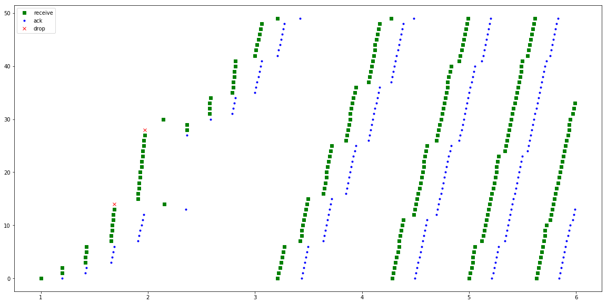


## Tahoe three packet drop


```python
# read the tahoe one packet drop trace
tahoe_drop_3 = './tahoe/pkt_drop_3/out.tr'
traces_tahoe_drop_3 = get_traces(tahoe_drop_3)
```


```python
total_pkts['t'][2], pkts_src_dest['t'][2], avg_delay['t'][2], avg_rtt['t'][2] = total_through(traces_tahoe_drop_3)
```

    Total time simulation run :  4.99076
    Total number of packets recevied by destination node (node-4) :  214
    Packets per sec from node-3 to node-4 :  42.8792408370669
    Total Data passed from node-3 to node-4 :  222560
    Data per sec :  44594.41047054958
    Packets from source (node-0) to destination (node-4) :  214
    Packets/sec from source (node-0) to destination (node-4) :  42.8792408370669
    Data from source (node-0) to destination (node-4) :  222560
    Data/sec from source (node-0) to destination (node-4) :  44594.41047054958
    Average delay from source (node-0) to destination (node-1) :  0.1328927102803738
    Average Round Trip Time for a packet froms source (node-0) to destination (node-1) :  0.22301536842105252


```python
plot(traces_tahoe_drop_3)
```


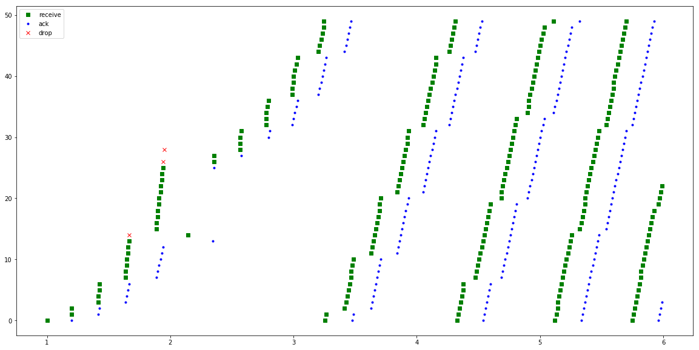


## Reno one packet drop


```python
# read the tahoe one packet drop trace
reno_drop_1 = './reno/pkt_drop_1/out.tr'
traces_reno_drop_1 = get_traces(reno_drop_1)
```


```python
total_pkts['r'][0], pkts_src_dest['r'][0], avg_delay['r'][0], avg_rtt['r'][0] = total_through(traces_reno_drop_1)
```

    Total time simulation run :  4.9922
    Total number of packets recevied by destination node (node-4) :  284
    Packets per sec from node-3 to node-4 :  56.88874644445334
    Total Data passed from node-3 to node-4 :  295360
    Data per sec :  59164.29630223148
    Packets from source (node-0) to destination (node-4) :  284
    Packets/sec from source (node-0) to destination (node-4) :  56.88874644445334
    Data from source (node-0) to destination (node-4) :  295360
    Data/sec from source (node-0) to destination (node-4) :  59164.29630223148
    Average delay from source (node-0) to destination (node-1) :  0.12665760563380257
    Average Round Trip Time for a packet froms source (node-0) to destination (node-1) :  0.21852480620155051


```python
plot(traces_reno_drop_1)
```


## Reno two packets drop


```python
# read the tahoe one packet drop trace
reno_drop_2 = './reno/pkt_drop_2/out.tr'
traces_reno_drop_2 = get_traces(reno_drop_2)
```


```python
total_pkts['r'][1], pkts_src_dest['r'][1], avg_delay['r'][1], avg_rtt['r'][1] = total_through(traces_reno_drop_2)
```

    Total time simulation run :  4.92772
    Total number of packets recevied by destination node (node-4) :  141
    Packets per sec from node-3 to node-4 :  28.613638761942642
    Total Data passed from node-3 to node-4 :  146640
    Data per sec :  29758.184312420348
    Packets from source (node-0) to destination (node-4) :  141
    Packets/sec from source (node-0) to destination (node-4) :  28.613638761942642
    Data from source (node-0) to destination (node-4) :  146640
    Data/sec from source (node-0) to destination (node-4) :  29758.184312420348
    Average delay from source (node-0) to destination (node-1) :  0.13934340425531908
    Average Round Trip Time for a packet froms source (node-0) to destination (node-1) :  0.23185477477477517


```python
plot(traces_reno_drop_2)
```


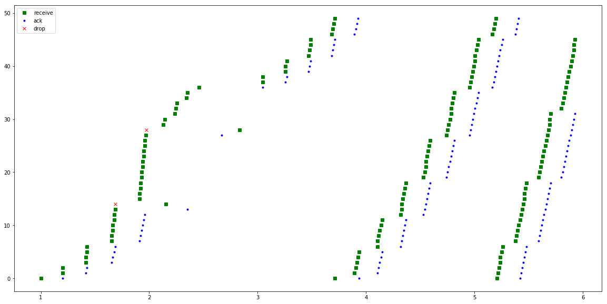


## Reno three packets drop


```python
# read the tahoe one packet drop trace
reno_drop_3 = './reno/pkt_drop_3/out.tr'
traces_reno_drop_3 = get_traces(reno_drop_3)
```


```python
total_pkts['r'][2], pkts_src_dest['r'][2], avg_delay['r'][2], avg_rtt['r'][2] = total_through(traces_reno_drop_3)
```

    Total time simulation run :  4.91852
    Total number of packets recevied by destination node (node-4) :  139
    Packets per sec from node-3 to node-4 :  28.260533656465768
    Total Data passed from node-3 to node-4 :  144560
    Data per sec :  29390.955002724397
    Packets from source (node-0) to destination (node-4) :  139
    Packets/sec from source (node-0) to destination (node-4) :  28.260533656465768
    Data from source (node-0) to destination (node-4) :  144560
    Data/sec from source (node-0) to destination (node-4) :  29390.955002724397
    Average delay from source (node-0) to destination (node-1) :  0.1402240287769783
    Average Round Trip Time for a packet froms source (node-0) to destination (node-1) :  0.24129477477477515


```python
plot(traces_reno_drop_3)
```


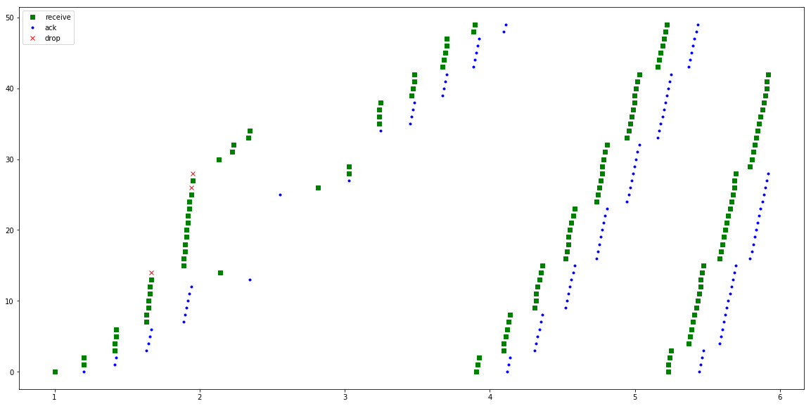


## Newreno one packet drop


```python
# read the tahoe one packet drop trace
newreno_drop_1 = './newreno/pkt_drop_1/out.tr'
traces_newreno_drop_1 = get_traces(newreno_drop_1)
```


```python
total_pkts['n'][0], pkts_src_dest['n'][0], avg_delay['n'][0], avg_rtt['n'][0] = total_through(traces_newreno_drop_1)
```

    Total time simulation run :  4.9922
    Total number of packets recevied by destination node (node-4) :  284
    Packets per sec from node-3 to node-4 :  56.88874644445334
    Total Data passed from node-3 to node-4 :  295360
    Data per sec :  59164.29630223148
    Packets from source (node-0) to destination (node-4) :  284
    Packets/sec from source (node-0) to destination (node-4) :  56.88874644445334
    Data from source (node-0) to destination (node-4) :  295360
    Data/sec from source (node-0) to destination (node-4) :  59164.29630223148
    Average delay from source (node-0) to destination (node-1) :  0.12665760563380257
    Average Round Trip Time for a packet froms source (node-0) to destination (node-1) :  0.21852480620155051


```python
plot(traces_newreno_drop_1)
```


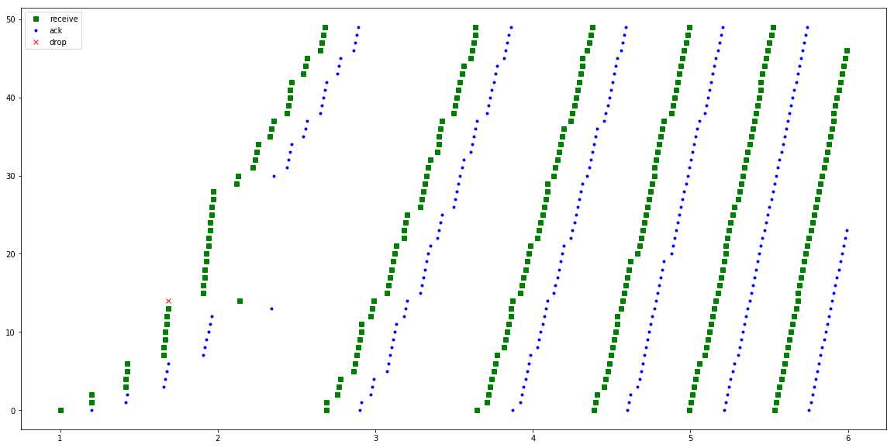


## Newreno two packets drop


```python
# read the tahoe one packet drop trace
newreno_drop_2 = './newreno/pkt_drop_2/out.tr'
traces_newreno_drop_2 = get_traces(newreno_drop_2)
```


```python
total_pkts['n'][1], pkts_src_dest['n'][1], avg_delay['n'][1], avg_rtt['n'][1] = total_through(traces_newreno_drop_2)
```

    Total time simulation run :  4.99628
    Total number of packets recevied by destination node (node-4) :  268
    Packets per sec from node-3 to node-4 :  53.63990809162017
    Total Data passed from node-3 to node-4 :  278720
    Data per sec :  55785.50441528497
    Packets from source (node-0) to destination (node-4) :  268
    Packets/sec from source (node-0) to destination (node-4) :  53.63990809162017
    Data from source (node-0) to destination (node-4) :  278720
    Data/sec from source (node-0) to destination (node-4) :  55785.50441528497
    Average delay from source (node-0) to destination (node-1) :  0.12733656716417913
    Average Round Trip Time for a packet froms source (node-0) to destination (node-1) :  0.22037831932773103


```python
plot(traces_newreno_drop_2)
```


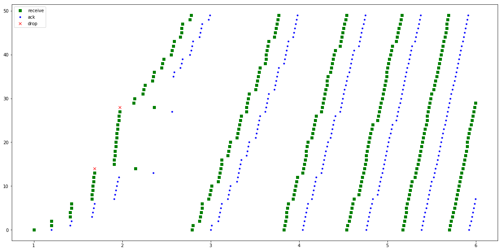


## Newreno 3 packets drop


```python
# read the tahoe one packet drop trace
newreno_drop_3 = './newreno/pkt_drop_3/out.tr'
traces_newreno_drop_3 = get_traces(newreno_drop_3)
```


```python
total_pkts['n'][2], pkts_src_dest['n'][2], avg_delay['n'][2], avg_rtt['n'][2] = total_through(traces_newreno_drop_3)
```

    Total time simulation run :  4.99076
    Total number of packets recevied by destination node (node-4) :  252
    Packets per sec from node-3 to node-4 :  50.49331163991056
    Total Data passed from node-3 to node-4 :  262080
    Data per sec :  52513.044105506975
    Packets from source (node-0) to destination (node-4) :  252
    Packets/sec from source (node-0) to destination (node-4) :  50.49331163991056
    Data from source (node-0) to destination (node-4) :  262080
    Data/sec from source (node-0) to destination (node-4) :  52513.044105506975
    Average delay from source (node-0) to destination (node-1) :  0.12843476190476177
    Average Round Trip Time for a packet froms source (node-0) to destination (node-1) :  0.22377881278538808


```python
plot(traces_newreno_drop_3)
```


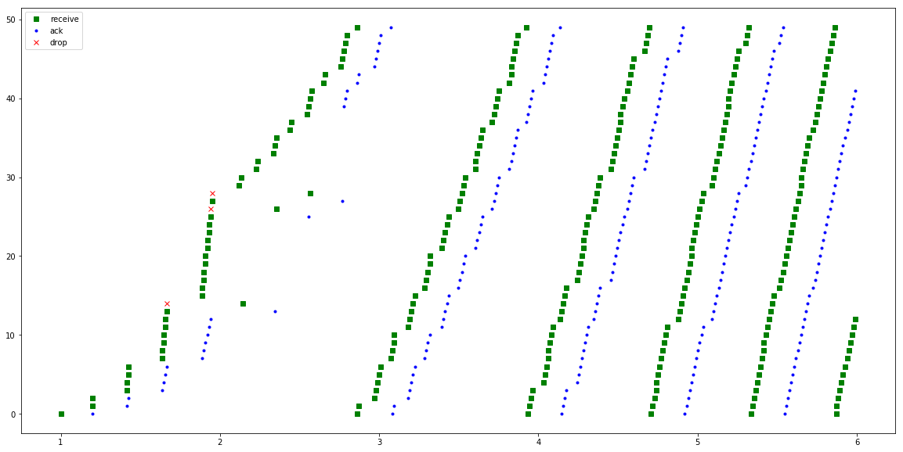


## SACK 1 packet drop


```python
# read the tahoe one packet drop trace
sack_drop_1 = './sack/pkt_drop_1/out.tr'
traces_sack_drop_1 = get_traces(sack_drop_1)
```


```python
total_pkts['s'][0], pkts_src_dest['s'][0], avg_delay['s'][0], avg_rtt['s'][0] = total_through(traces_sack_drop_1)
```

    Total time simulation run :  4.992288
    Total number of packets recevied by destination node (node-4) :  281
    Packets per sec from node-3 to node-4 :  56.28681678621105
    Total Data passed from node-3 to node-4 :  292240
    Data per sec :  58538.28945765949
    Packets from source (node-0) to destination (node-4) :  281
    Packets/sec from source (node-0) to destination (node-4) :  56.28681678621105
    Data from source (node-0) to destination (node-4) :  292240
    Data/sec from source (node-0) to destination (node-4) :  58538.28945765949
    Average delay from source (node-0) to destination (node-1) :  0.12694204982206392
    Average Round Trip Time for a packet froms source (node-0) to destination (node-1) :  0.21873690980392155


```python
plot(traces_sack_drop_1)
```


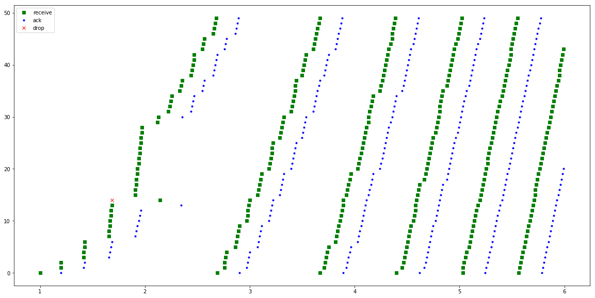


## SACK 2-packets drop


```python
# read the tahoe one packet drop trace
sack_drop_2 = './sack/pkt_drop_2/out.tr'
traces_sack_drop_2 = get_traces(sack_drop_2)
```


```python
total_pkts['s'][1], pkts_src_dest['s'][1], avg_delay['s'][1], avg_rtt['s'][1] = total_through(traces_sack_drop_2)
```

    Total time simulation run :  4.996544
    Total number of packets recevied by destination node (node-4) :  269
    Packets per sec from node-3 to node-4 :  53.837212281128714
    Total Data passed from node-3 to node-4 :  279760
    Data per sec :  55990.700772373864
    Packets from source (node-0) to destination (node-4) :  269
    Packets/sec from source (node-0) to destination (node-4) :  53.837212281128714
    Data from source (node-0) to destination (node-4) :  279760
    Data/sec from source (node-0) to destination (node-4) :  55990.700772373864
    Average delay from source (node-0) to destination (node-1) :  0.12725762081784384
    Average Round Trip Time for a packet froms source (node-0) to destination (node-1) :  0.22016138842975194


```python
plot(traces_sack_drop_2)
```


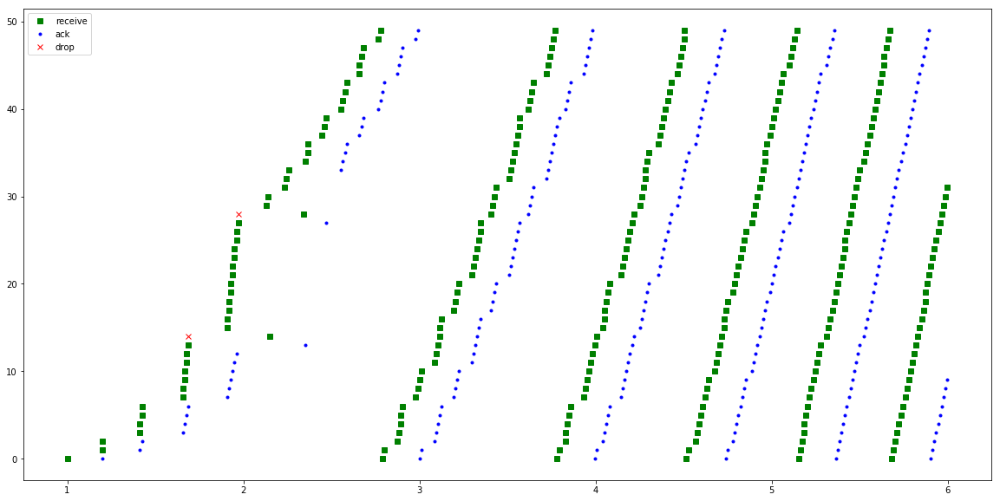


## SACK 3-packets drop


```python
# read the tahoe one packet drop trace
sack_drop_3 = './sack/pkt_drop_3/out.tr'
traces_sack_drop_3 = get_traces(sack_drop_3)
```


```python
total_pkts['s'][2], pkts_src_dest['s'][2], avg_delay['s'][2], avg_rtt['s'][2] = total_through(traces_sack_drop_3)
```

    Total time simulation run :  4.997432
    Total number of packets recevied by destination node (node-4) :  268
    Packets per sec from node-3 to node-4 :  53.62754310613931
    Total Data passed from node-3 to node-4 :  278720
    Data per sec :  55772.64483038489
    Packets from source (node-0) to destination (node-4) :  268
    Packets/sec from source (node-0) to destination (node-4) :  53.62754310613931
    Data from source (node-0) to destination (node-4) :  278720
    Data/sec from source (node-0) to destination (node-4) :  55772.64483038489
    Average delay from source (node-0) to destination (node-1) :  0.12755029850746258
    Average Round Trip Time for a packet froms source (node-0) to destination (node-1) :  0.2211333770491802


```python
plot(traces_sack_drop_3)
```


## Summary

Tahoe shows degrading throughput for multiple packet drop.

Reno shows better performance than Tahoe but it show bad performance in case of multiple packet lost

New Reno recovers fast then Reno but in case of partial ACK it shows bad recovery.

SACK performs better in case of partial ack

### Total Packets through

Below graph shows the number of packet through for 1-pkt drop, 2-pkt drop and 3-pkt drop scenarios.

As can be seen, Reno does bad job in 2-pkt and 3-pkt drop scenario and sack is doing good for multiple packet lost or parital ack scenario


```python
plt.figure(figsize=(20,8))

scnearios = [1, 2, 3]

plt.plot(scnearios, pkts_src_dest['t'], '-s', color='green', label='tahoe')
plt.plot(scnearios, pkts_src_dest['n'], '-s', color='blue', label='new reno')
plt.plot(scnearios, pkts_src_dest['r'], '-s', color='black', label='reno')
plt.plot(scnearios, pkts_src_dest['s'], '-s', color='red', label='sack')

plt.legend(loc='upper right')

plt.show()
```


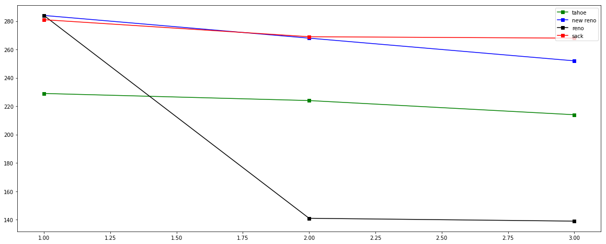


### Average delay

Again as can be seen Reno is doing bad in case of partial ack or multiple packets drop. However SACK is doing good beacuse of pipe data structure in case of multiple packets drop, New Reno is also keeping well with SACK but lagged bit in cause of paritial ack.


```python
plt.figure(figsize=(20,8))

scnearios = [1, 2, 3]

plt.plot(scnearios, avg_delay['t'], '-s', color='green', label='tahoe')
plt.plot(scnearios, avg_delay['n'], '-s', color='blue', label='new reno')
plt.plot(scnearios, avg_delay['r'], '-s', color='black', label='reno')
plt.plot(scnearios, avg_delay['s'], '-s', color='red', label='sack')

plt.legend(loc='upper right')

plt.show()
```


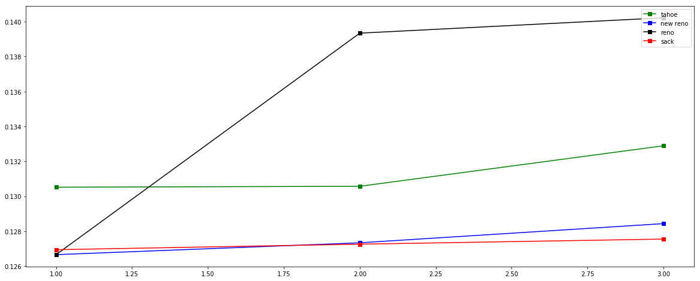


### Average round trip time

SACK is doing good in case for 3-pkts drop. Reno is doing bad in average round trip time.


```python
plt.figure(figsize=(20,8))

scnearios = [1, 2, 3]

plt.plot(scnearios, avg_rtt['t'], '-s', color='green', label='tahoe')
plt.plot(scnearios, avg_rtt['n'], '-s', color='blue', label='new reno')
plt.plot(scnearios, avg_rtt['r'], '-s', color='black', label='reno')
plt.plot(scnearios, avg_rtt['s'], '-s', color='red', label='sack')

plt.legend(loc='upper right')

plt.show()
```


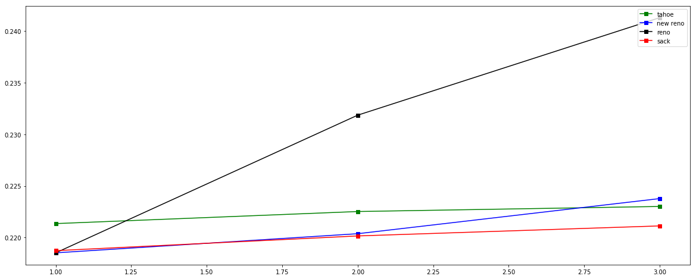


ref : http://user.it.uu.se/~perg/course/datakom2/it98/tcpsims_lab.html
